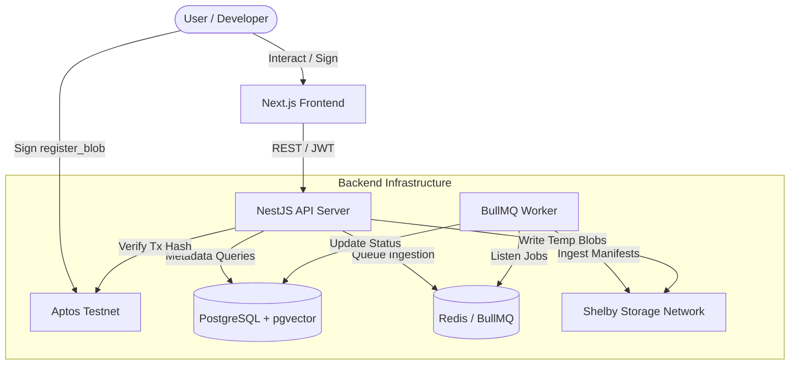
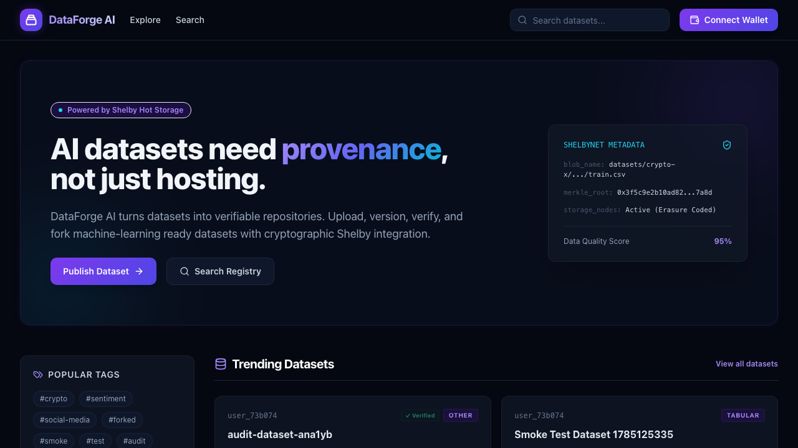
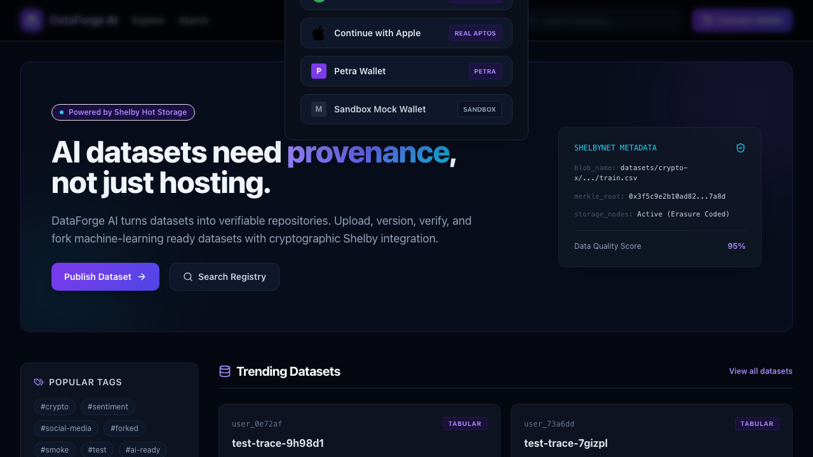
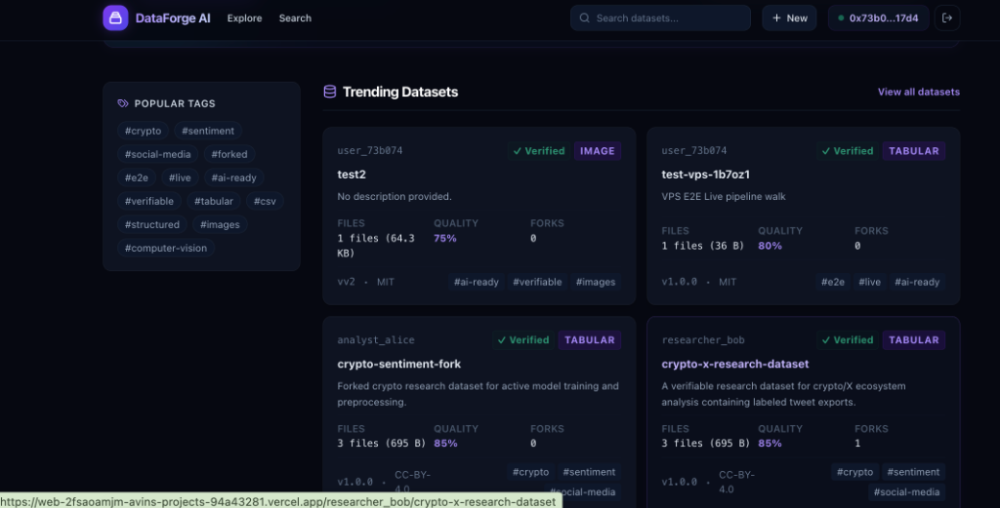
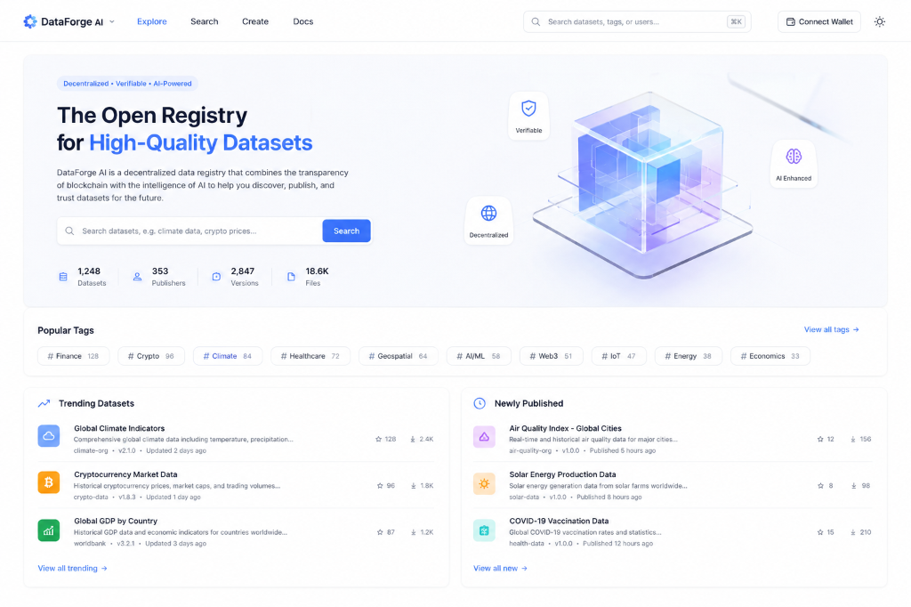

# DataForge AI

<div align="center">
  
  <h2>GitHub for AI Datasets</h2>
  <p><strong>Cryptographic provenance, decentralized storage, and semantic version control for machine learning datasets.</strong></p>

  <p>
    <a href="https://web-gamma-green-wd3aonhbdz.vercel.app"><strong>Live Demo</strong></a> •
    <a href="docs/api.md"><strong>API Reference</strong></a> •
    <a href="docs/architecture.md"><strong>Documentation</strong></a> •
    <a href="https://github.com/Avnsmith/Dataforge"><strong>GitHub Repository</strong></a>
  </p>

  <!-- Repository Badges -->
  
  
  
  
  
  
  
  
</div>

---

## Why DataForge?

Modern machine learning models depend on high-quality datasets, yet data management practices remain severely outdated compared to code versioning:
* **Scattered Cloud Storage**: Datasets are scattered across various S3 buckets, Google Drives, or local drives with no unified registry.
* **No Provenance**: It is difficult to trace dataset origins, author signatures, or historical derivations.
* **Poor Reproducibility**: Training scripts reference static local folders or unversioned links, making model training impossible to reproduce exactly.
* **Difficult Versioning**: Git-based systems do not handle multi-gigabyte dataset files gracefully.
* **Lack of Cryptographic Verification**: There is no cryptographically-backed proof linking the storage layer to on-chain registry transactions.

DataForge AI solves these problems by creating a **decentralized, cryptographically-proven dataset hub** that acts as the "GitHub for AI Datasets."

---

## Key Features

* **Dataset Registry**: Public and private repository hosting for ML-ready datasets.
* **Semantic Versioning**: Freeze and publish datasets under explicit semver tags (e.g. `1.0.0`).
* **Cryptographic Provenance**: File registrations are recorded on the **Aptos Testnet** ledger.
* **Decentralized Storage**: Integrates with the **Shelby Storage** network to host raw dataset blocks.
* **Wallet-Based Authentication**: Nonce-challenge cryptographic login utilizing Aptos wallet extensions (Petra Wallet).
* **Merkle Root Commitments**: Uses on-chain Merkle Root commitments to guarantee block-level data integrity.
* **Dataset Lineage Tree**: Visual and logical lineage tracking to show historical derivations when repositories are forked.
* **Automatic Manifest Generation**: Compiles files, sizes, hashes, and lineage details into a versioned `manifest.json`.
* **REST API & SDK Ready**: Programmatic interface for automated dataset upload and download pipelines.

---

## Architecture

DataForge AI is split into a Next.js web application, a NestJS orchestration API, background ingestion workers, PostgreSQL metadata storage, and Shelby decentralized storage verified on the Aptos Testnet.



For more details, see the [Architecture Guide](file:///Users/vinh/Documents/Shelby/docs/architecture.md).

---

## Repository Structure

DataForge is organized as a monorepo workspace:

```
├── apps/
│   ├── web/        # Next.js Frontend (React, TailwindCSS, Wallet Adapter)
│   └── api/        # NestJS API Backend (Orchestration, Controllers, Ingestion Queue)
├── packages/
│   ├── db/         # Database Layer (Prisma ORM, PostgreSQL schema & migrations)
│   ├── shelby/     # Shelby Storage Provider Client (Mock/Live drivers)
│   ├── ai/         # AI Utilities (Metadata parsing & vector embeddings helpers)
│   └── shared/     # Shared DTOs, types, and validation schemas
└── docs/           # Product and technical documentation
```

For package setup metadata, see the individual packages.

---

## Screenshots

### Landing Page & Dashboard (Logged Out)

*DataForge AI landing page introducing cryptographic provenance, repository statistics, and decentralized dataset registry.*

### Wallet Connection Overlay

*Cryptographic login challenge prompt supporting Petra Wallet, Sandbox mock wallet, and standard Aptos authentication.*

### Active Logged-In Home Page

*Browse and manage verified dataset repositories (e.g. test-vps-1b7oz1, crypto-x-research-dataset) once connected to Aptos Testnet.*

### Alternative Light Mode Interface

*Alternative light mode repository style showcasing category tags, dataset sizes, quality scores, and fork counts.*

---

## Getting Started

### 1. Environment Configuration

Copy the example environment file and configure variables:

```bash
cp .env.example .env
```

Define the database connection, Redis URLs, JWT secrets, and Shelby network credentials:

* `DATABASE_URL`: PostgreSQL connection string.
* `REDIS_URL`: Redis server URL.
* `SHELBY_MODE`: `mock` (local filesystem) or `live` (on-chain Shelby network gateway).
* `SHELBY_NETWORK`: `'testnet'` (Aptos Testnet).
* `SHELBY_PRIVATE_KEY`: Your Aptos wallet private key.
* `SHELBY_ACCOUNT`: Your Aptos wallet account address.

### 2. Local Development Setup

To run both the frontend and backend concurrently in development mode:

```bash
# Install dependencies
npm install

# Run database migrations
npm run db:migrate:deploy
npm run db:generate

# Start Next.js and NestJS servers
npm run dev
```

The frontend will start at `http://localhost:3000` and the API server at `http://localhost:4000/api`.

### 3. Docker Compose Production Deployment

To spin up the entire production-ready ecosystem locally (PostgreSQL, Redis, API Server, Worker):

```bash
docker compose --env-file /opt/dataforge/env/.env up -d --build
```

---

## Documentation

Comprehensive documentation of the DataForge AI architecture and flows is available:
* **[System Architecture](file:///Users/vinh/Documents/Shelby/docs/architecture.md)**
* **[Storage & Provenance](file:///Users/vinh/Documents/Shelby/docs/storage.md)**
* **[Publishing & Ingestion Flow](file:///Users/vinh/Documents/Shelby/docs/publishing-flow.md)**
* **[API Reference](file:///Users/vinh/Documents/Shelby/docs/api.md)**
* **[Platform Roadmap](file:///Users/vinh/Documents/Shelby/docs/roadmap.md)**

---

## Roadmap

* [x] **Implemented**: Nonce-challenge wallet handshake, Aptos Testnet verification, Shelby Storage mock/live engines, semantic versions, and lineage tracking.
* [ ] **In Progress**: Vector similarity dataset searches, wallet connection persistence, and CLI integration tools.
* [ ] **Future**: Multi-chain registry verification (Sui, Ethereum), direct Jupyter Notebook Python SDK loaders.

---

## Contributing

We welcome contributions to DataForge AI! Please read our [Contributing Guidelines](docs/CONTRIBUTING.md) to get started.

---

## License

This project is licensed under the Apache 2.0 License. See the [LICENSE](LICENSE) file for details.
