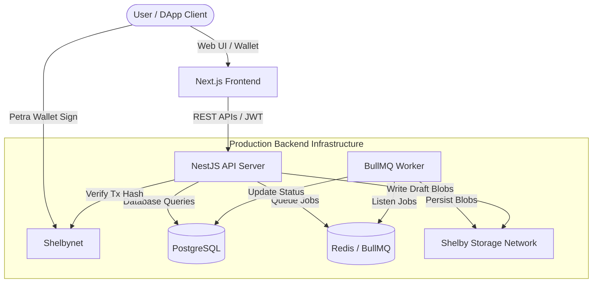

# DataForge AI Architecture

DataForge AI is a monorepo platform designed to provide "GitHub for AI Datasets." It integrates cryptographic provenance, decentralized storage, and semantic version control into a cohesive, production-ready system.

---

## High-Level Architecture

The following diagram illustrates the relationship between components:

---

## Monorepo Components

The project structure is organized as a Yarn/NPM workspace monorepo:

### Applications (`apps/`)

* **`apps/web` (Next.js Frontend)**:
  * Responsive, glassmorphic UI built using React and TailwindCSS.
  * Interfaces with the `@aptos-labs/wallet-adapter-react` to support wallet connection (Petra Wallet) and client-side transaction signing.
  * Fetches dataset metadata, lineage trees, and file previews from the backend API.
  
* **`apps/api` (NestJS Backend)**:
  * Orchestrates user authentication, dataset registration, and version states.
  * Formulates transaction payloads for on-chain registry contracts.
  * Validates transaction hashes on Shelbynet before confirming metadata.
  * Spawns queue jobs via BullMQ for background ingestion processing.

### Packages (`packages/`)

* **`packages/db`**:
  * Integrates the database layer using Prisma ORM.
  * Contains PostgreSQL migrations and schema definitions with `pgvector` compatibility.
  * Exports type-safe db clients shared across apps.
  
* **`packages/shelby`**:
  * Core provider for Shelby storage network.
  * Supports `mock` (local filesystem volume) and `live` (decentralized Aptos storage node) modes.
  * Handles metadata hashing, chunking, and upload validation protocols.

* **`packages/ai`**:
  * Handles AI metadata parsing, vector embeddings generation, and similarity searches.

* **`packages/shared`**:
  * Shared types, interfaces, validation schemas, and DTOs shared between frontend and backend.

---

## Processing Model

1. **Authentication**: Uses a cryptographic nonce challenge handshake. The backend generates a database-saved nonce, which the client signs using their wallet's private key. The backend verifies the signature using the derived public key to issue a JWT.
2. **Metadata Ingestion**: The database records ownership, tag categories, and semantic versions. Files are prepared on-chain via entry function calls.
3. **Queue-Based Ingestion**: Large uploads, metadata parsing, and version compilation are offloaded to background BullMQ workers. This prevents HTTP timeouts and ensures resilient retry behaviors.
4. **On-Chain Verification**: The backend queries Shelbynet RPC endpoints directly to verify that transactions registered on the frontend match the sender, Merkle root, and expected file size parameters before committing dataset transitions.
