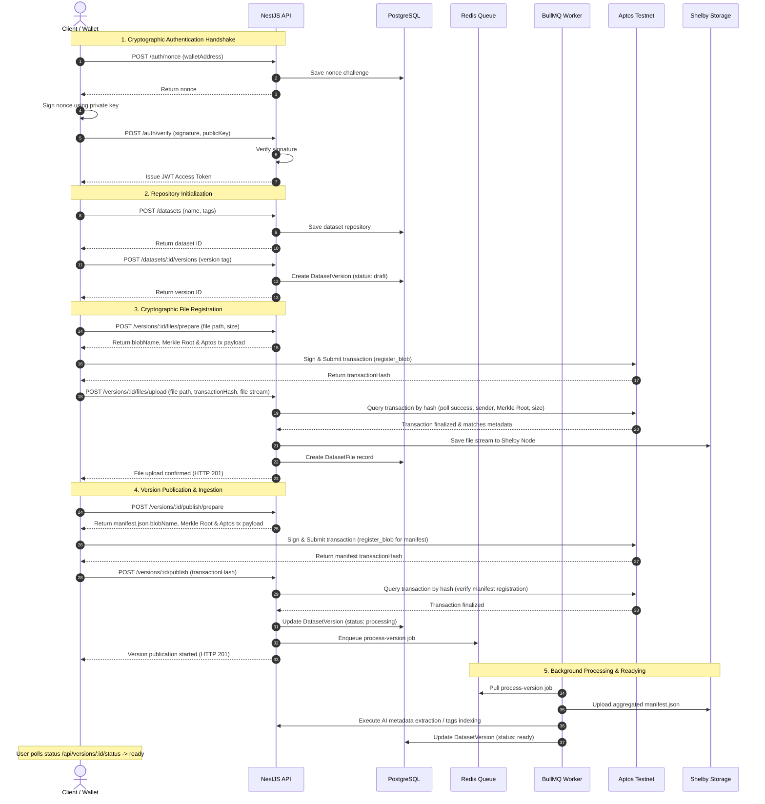

# DataForge AI Publishing & Ingestion Flow

This document details the step-by-step lifecycle of creating, uploading, verifying, and publishing a dataset version on DataForge AI.

---

## Complete Lifecycle Workflow

The sequence below traces the interaction between the Client (Browser & Petra Wallet), the NestJS API backend, the PostgreSQL DB, the background BullMQ Worker, the Shelby Storage node, and the Aptos Testnet blockchain.

---

## Detailed Step Description

### 1. Cryptographic Authentication Handshake
* Rather than traditional passwords, users log in using their wallet address.
* The backend generates a secure challenge UUID (nonce) saved to Redis/DB with an expiration.
* The browser prompts the wallet extension (e.g. Petra) to sign the nonce.
* The signature is posted back and verified cryptographically using the derived public key. If valid, a standard JWT token is returned to the client to authorize subsequent requests.

### 2. Repository & Version Setup
* The user registers a dataset metadata container (a Repository). This can be public or private.
* A version record is created using semver notation (e.g. `1.0.0`) in a `draft` state. A version represents a frozen snapshot of the dataset files.

### 3. Cryptographic File Upload & Verification
* For each file to be uploaded, the client calls `/files/prepare`. The backend returns the expected storage path, the calculated Merkle Root, and a pre-formulated payload for the Aptos transaction.
* The client submits this transaction calling the `register_blob` function on the Aptos Testnet.
* The client passes the resulting transaction hash along with the file stream to `/files/upload`.
* **Important**: The backend queries the Aptos Testnet nodes to confirm that the transaction was successfully finalized, the sender matches the dataset owner, and the Merkle Root/file size parameters match what was prepared. If validated, the file bytes are written to Shelby Storage.

### 4. Manifest Compilation & Version Publication
* When the user clicks "Publish Version", the backend prepares a `manifest.json` file aggregating all files, hashes, sizes, and lineage metadata.
* Just like regular files, the `manifest.json` must be registered on-chain by the user.
* Once the manifest transaction is validated by the backend, the version status changes to `processing`, and a background job is enqueued in BullMQ.

### 5. Background Worker Processing
* The BullMQ worker builds the version manifest, uploads it to Shelby, extracts metadata, indexes searchable keywords, and updates the version status to `ready`.
* The frontend receives the state change, making the version available for lineage tracking, search queries, and downloads.
